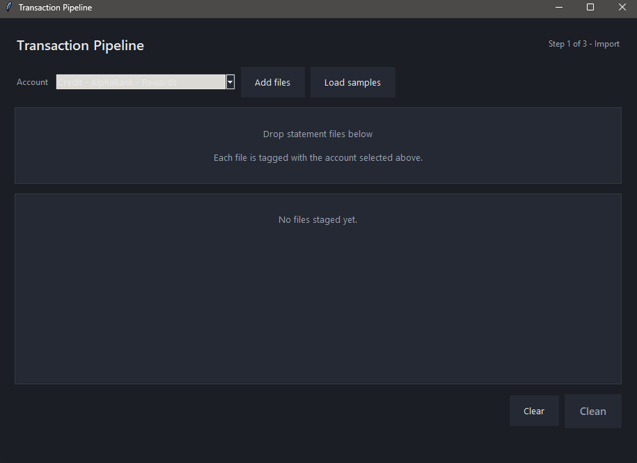
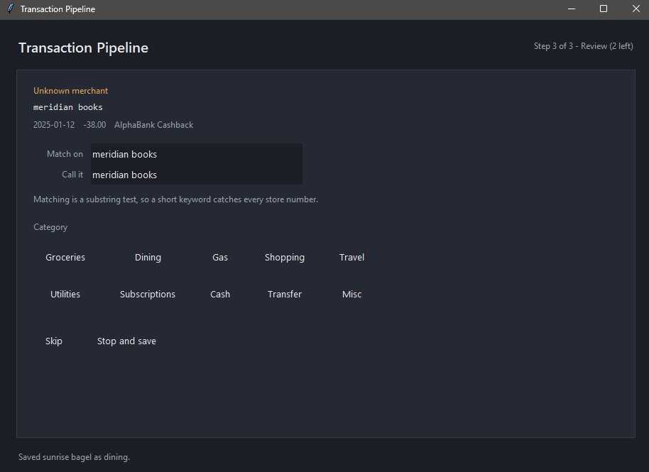
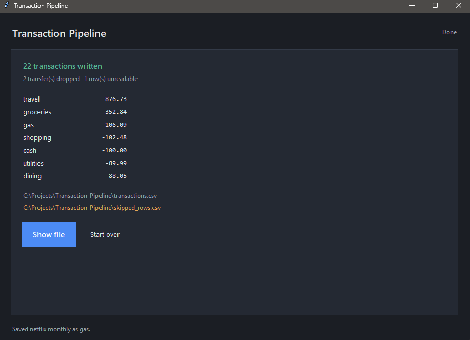

# Transaction Pipeline

Turns raw bank and credit card statement exports into one clean, categorized
CSV, through a single window that stays open from the drop zone to the totals.

Every bank exports a different shape of file: different column orders, junk
columns, preamble rows, date formats, and disagreement about whether spending
is a positive or a negative number. This reconciles them, names the merchants,
categorizes them, and remembers every answer so it only ever asks once.

## Screens

Stage files against the account they came from:



Name anything the maps did not recognize, once, with the transaction in front
of you:



Then the totals and where the output went:



## Try it

```bash
python app.py
```

Press **Load samples** and then **Clean 5 files**. Five statements in five
different export formats are bundled in `sample_statements/`, so the app has
something to chew on without any statements of your own.

Three of the sample merchants are deliberately missing from the maps, so the
review step has something to ask about. Answer them and they are never asked
again.

## How it works

1. **Stage** - pick an account, then drag statements onto the window or use
   **Add files**. Each file is tagged with the account it came from.
2. **Clean** - every file is read with its own account's rules: skip this many
   preamble rows, these columns in this order, this date format, and flip the
   sign if the bank records spending as a positive number. A row the pipeline
   cannot read is set aside and reported, never guessed at.
3. **Review** - anything the maps could not name comes up one at a time, with
   the date, amount and account for context. You choose the substring to match
   on, so one answer covers every store number that merchant will ever use.
4. **Summary** - totals by category, and the path to the output.

Card payments and transfers between your own accounts are dropped, because
they are bookkeeping rather than spending.

## Files

| File | What it holds |
| --- | --- |
| `app.py` | The dashboard. One window, four views, no other UI anywhere. |
| `pipeline.py` | All the data work. No tkinter, so it is importable and testable. |
| `accounts.json` | One entry per account: column layout, date format, amount sign. |
| `merchants.csv` | `keyword,merchant` - matched as a substring, longest keyword first. |
| `categories.csv` | `merchant,category` - every merchant name maps to one category. |
| `sample_statements/` | One sample export per account, named after it. |
| `test_pipeline.py` | Tests, run against those samples. |

Output lands in `transactions.csv`, with any unreadable rows in
`skipped_rows.csv`. Both are gitignored.

## Adding an account

Add an entry to `accounts.json`. No code changes:

```json
{
    "type": "Credit",
    "bank": "BetaBank",
    "card": "Everyday",
    "skip_rows": 1,
    "columns": ["Date", "*", "Description", "*", "*", "Amount", "*"],
    "date_format": "%Y-%m-%d",
    "amount_sign": 1
}
```

- `skip_rows` - preamble rows above the data.
- `columns` - the file's columns in order. `*` means throw this one away.
  Only `Date`, `Description` and `Amount` are used.
- `date_format` - a `strptime` format string.
- `amount_sign` - `1` if the file already records spending as negative, `-1`
  if it records it as positive.

`type`, `bank` and `card` must not contain underscores; they are joined with
underscores to make the account's identifier.

## Categories

`groceries`, `dining`, `gas`, `shopping`, `travel`, `utilities`,
`subscriptions`, `cash`, `transfer`, `misc`.

The list lives in `pipeline.CATEGORIES` and nowhere else. The dashboard builds
its buttons from it and the tests assert that nothing in `categories.csv`
falls outside it, so the two cannot drift apart.

## Requirements

Python 3.10 or newer. Nothing else is required: the pipeline uses only the
standard library, and tkinter ships with Python.

Drag and drop needs one optional package. Without it the app runs fine and the
drop zone tells you to use **Add files** instead.

```bash
pip install tkinterdnd2
```

## Tests

```bash
python -m unittest
```

26 tests covering amount and date parsing across all five export formats,
preamble and header handling, unreadable rows, longest-keyword matching,
transfer dropping, and the output file's shape.

## Notes

The maps that ship here hold national chains and generic banking keywords only.
They are seed data, not anyone's spending history.

Files are read, never moved or deleted. Everything runs on the main thread,
which is fine for statement-sized files and keeps the window honest about what
it is doing.
